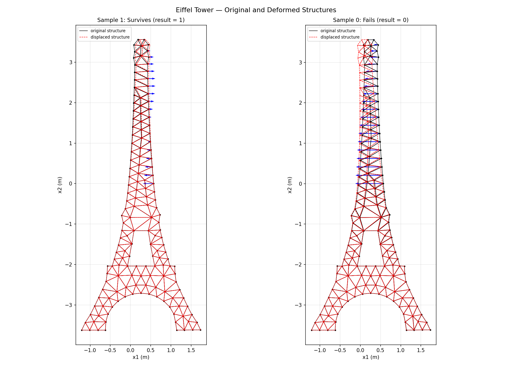
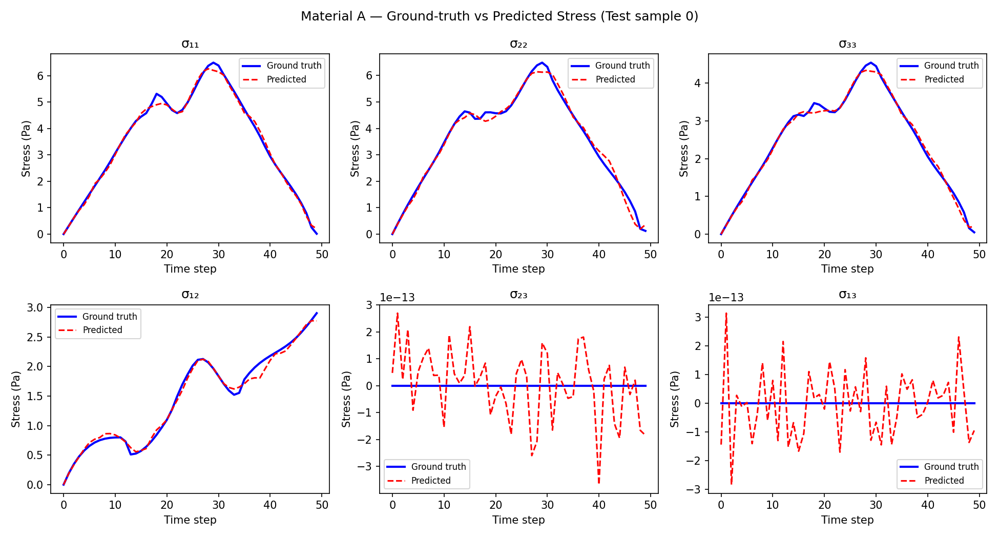
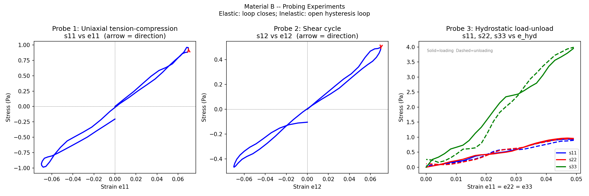

# Neural Constitutive Modelling and Structural Certification

Deep networks that learn unknown materials' stress–strain laws from loading data, then act as virtual test rigs to identify each material's physics. A companion classifier certifies an Eiffel Tower truss against failure with **97.5 % accuracy and zero unsafe designs passed**.


<sub>Two finite-element load cases from the certification dataset: original (black) and deformed (red dashed) truss. Left: the tower survives. Right: a strut exceeds the 500 MPa failure strength.</sub>

## Overview

Engineering design needs two things from a material model: an accurate stress–strain law and a fast answer to "will this structure survive?". This project learns both from data.

**Part 1** trains residual networks to map full strain histories to full stress histories for three unknown materials. It then *probes* the trained networks with synthetic load paths (uniaxial, shear, biaxial, hydrostatic, cyclic, ratcheting) to infer each material's physics: elastic or inelastic, isotropic or anisotropic, linear or not.

**Part 2** replaces a finite-element solve with a neural classifier that certifies a 2D Eiffel Tower truss as safe or unsafe from the 20-point pressure profile applied to its upper half. It compares FCNN, ResNet and U-Net inductive biases.

## Key results

**Constitutive learning (1,100 loading paths per material, 80/20 split).** Median per-path RMSE on held-out paths:

| Material | Loading | Median RMSE | Worst RMSE | Physics identified by probing the trained network |
|---|---|---|---|---|
| A | multiaxial, plane strain | **0.093 Pa** | 0.182 Pa | Nonlinear (hyperelastic-like): no hysteresis; tangent stiffness rises ≈68 → 74 Pa, then softens to ≈33 Pa |
| B | full 3D, 6 components | **0.088 Pa** | 0.139 Pa | **Transversely isotropic**: under equal triaxial strain σ₃₃ ≈ 4.3 σ₁₁, while σ₁₁ ≈ σ₂₂ |
| C | uniaxial | 0.506 Pa | 1.07 Pa | Path-dependent plasticity: open loops, residual stress, cyclic hardening/softening, ratcheting |

- The network recovers the plane-strain out-of-plane reaction $\sigma_{33} \neq 0$ and predicts $\sigma_{23}, \sigma_{13}$ at ~10⁻¹³ Pa (numerically zero) without being told the symmetry.
- **Negative result, stated plainly.** For the plastic Material C, the train–test gap is about 1.5 orders of magnitude, and neither width, learning rate nor weight decay closes it. A feedforward path-to-path map lacks the inductive bias for evolving internal variables. That motivates the recurrent approach in [recurrent-operator-viscoplasticity](https://github.com/ebinezer-rajaram/recurrent-operator-viscoplasticity).

**Structural certification (1,000 FE samples, 800/200 split).**

| Architecture | Parameters | Test accuracy | Precision | Recall | Test BCE |
|---|---|---|---|---|---|
| FCNN | 185,217 | 97.0 % | **100 %** | 92.9 % | 0.082 |
| ResNet | 436,225 | **97.5 %** | **100 %** | 94.1 % | 0.078 |
| U-Net (FC encoder–decoder) | 212,961 | 97.0 % | 98.8 % | 94.1 % | **0.058** |

With "survives" as the positive class, **100 % precision means no failing tower was certified as safe** on the test set. The U-Net generalises best, with the lowest test loss and the smallest train–test gap.

<p align="center">
  
  
</p>
<sub>Left: Material A, all six predicted stress components against ground truth on a held-out path. Right: probing Material B. The hydrostatic probe (right panel) exposes a stiff 3-axis.</sub>

## Method

**Path-to-path operator.** Stress and strain are Voigt 6-vectors over 50 load steps. The network learns $f_\theta:\ \mathbb{R}^{6\times50}\to\mathbb{R}^{6\times50}$ ($\mathbb{R}^{50}\to\mathbb{R}^{50}$ for uniaxial Material C). It is a fully connected ResNet: an input projection, then $N_B$ blocks of $h \mapsto \mathrm{ReLU}(h + W_2\,\mathrm{ReLU}(W_1 h))$, then a linear head. Widths are 256 with 4 blocks for A/B (680k parameters) and 128 with 3 blocks for C (112k). Inputs and outputs are z-scored on training statistics only, with the zero-variance plane-strain channels clamped. Training uses MSE with Adam (lr $10^{-3}$, weight decay $10^{-4}$), cosine annealing over 500 epochs and early stopping (patience 50). A 200-epoch sweep over width, learning rate and weight decay tests sensitivity.

**Virtual experiments.** The trained networks are driven with controlled strain paths: load–unload triangles, sine cycles, equal-biaxial, hydrostatic and ratcheting paths. Hysteresis, residual stress and stress ratios then read out the constitutive class.

**Certification classifier.** A 20-dimensional standardised load profile is mapped to a survival logit, trained with `BCEWithLogitsLoss` (Adam, lr $10^{-3}$, batch 32, 200 epochs, same split for all models). The three architectures are:
- a tapered FCNN ($512\to256\to128\to64$, BatchNorm, dropout 0.3)
- a residual MLP (3 blocks at width 256)
- a U-Net-style encoder–decoder ($256\to128\to64\to32$ and back) with concatenative skips

Ground-truth labels come from a 2D truss FE model (direct stiffness method) with a 500 MPa strut failure criterion. That solver is re-implemented in Python for visualisation.

## Repository structure

```
neural-constitutive-modelling/
├── constitutive/                   # constitutive learning
│   ├── train_material_{a,b,c}.py     # train + evaluate one material each
│   ├── hyperparam_sweep.py           # width / lr / weight-decay sensitivity
│   ├── probing_experiments.py        # virtual experiments on trained networks
│   ├── nn_skeleton.py                # module-provided starter code
│   └── data/Material_{A,B,C}.mat     # 1100 paths x {6|1} components x 50 steps
└── certification/                  # structural certification
    ├── classifier_{fcnn,resnet,unet}.py  # survive/fail classifiers
    ├── plot_structures.py            # Python FE re-solve + deformed-shape plots
    ├── data/Eiffel_data.mat          # 1000 load profiles + survive/fail labels
    └── matlab/                       # FE data generator (GenData_Eiffel.m, ...)
```

## Reproducing

Scripts use paths relative to their own folder and write figures to `outputs/`. The metrics above are from the original runs; on a different PyTorch build the certification classifiers can differ by a test sample (the FCNN re-run on PyTorch 2.14 CPU gave 96.5% accuracy).

```bash
cd constitutive
python train_material_a.py        # likewise _b, _c
python hyperparam_sweep.py
python probing_experiments.py     # retrains A, B, C, then probes them

cd ../certification
python classifier_fcnn.py         # likewise classifier_resnet.py, classifier_unet.py
python plot_structures.py
```

Dependencies: `torch numpy h5py matplotlib` (for example `uv run --with torch --with numpy --with h5py --with matplotlib python ...`). MATLAB is only needed to regenerate `Eiffel_data.mat` via `matlab/GenData_Eiffel.m`.

## Tech stack

Python · PyTorch · NumPy · h5py (MATLAB v7.3 I/O) · Matplotlib · MATLAB (finite-element data generation)

## Acknowledgements

Originally developed for 4C11 Data-Driven and Learning-Based Methods in Mechanics and Materials, Department of Engineering, University of Cambridge, which provided the datasets, the MATLAB truss generator and starter code (`nn_skeleton.py`).

## Licence

[MIT](LICENSE)
